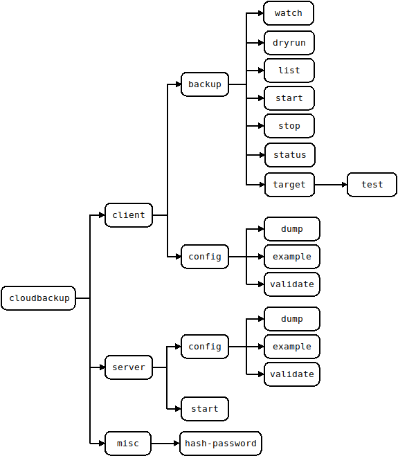
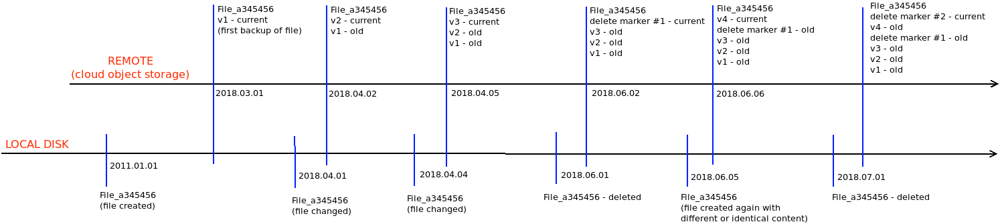

# Overview 

There is only one binary which can be started as a server or which can be used as a CLI client. In server mode this is the actual backup engine while the CLI's purpose is only to interact with the backup engine and give it instructions.

When running in server mode it requires a configuration file and also a set of static web assets which it uses for serving documentation or for service the static parts of a web UI.

## Command Stucture

The command and its main options are depicted below. Command line parameters are supported and can be discovered using the `--help` option. For example:
```
$ cloudbackup client backup dryrun --help
Usage:
  cloudbackup [OPTIONS] client backup dryrun [dryrun-OPTIONS] job_name

Help Options:
  -h, --help            Show this help message

[dryrun command options]
      -c, --configfile= Client configuration file expected to be in YAML format and have .yml or .yaml extension. If unspecified then the default is to attempt to use $HOME/.cloudbackup.yaml on Linux or Unixes and %HomeDrive%%HomePath% on Microsoft Windows
      -u, --username=   Username to use when connecting to the server. If not specified then an attempt will be made to use environment variable CLOUDBACKUP_CLIENT_USERNAME followed by an attempt to use the command line specified configuration file (if not specified then
                        a configuration file will be searched at the default location)
      -p, --password=   Password to use when connecting to the server. If not specified then an attempt will be made to use environment variable CLOUDBACKUP_CLIENT_PASSWORD followed by an attempt to use the command line specified configuration file (if not specified then
                        a configuration file will be searched at the default location)
      -a, --address=    Address to use when connecting to the server. The format expect is one of 'https://1.2.3.4:8443' or 'http://127.0.0.1:8080'. If not specified then an attempt will be made to use environment variable CLOUDBACKUP_CLIENT_ADDRESS followed by an
                        attempt to use the command line specified configuration file (if not specified then a configuration file will be searched at the default location)
      -d, --debug       Set logging to debug. WARNING! Secrets and passwords will be shown when using log level debug
          --jsonlog     Set logging to JSON. Defaults to plaintext
          --json        If the operation is successful then print JSON responses as they are received from server. If this option is not specified then the response is processed and the output is a plaintext table followed by a summary at the end.

[dryrun command arguments]
  job_name:             Name of the backup job to dry run. This needs to match a backup job as defined in the configuration of the server
```



## File Lifecycle



## Potential issues

- if a file is created locally and its creation date is set to be in the past then once backed up the file would be restored when also selecting a restore point which is before the file was created locally

## File Metadata

For backed up files:

- filepath
- owner
- size
- mtime
- ctime
- encrypted (bool)
- delete_marker (bool)
- filename_encoded (bool) if filename contains unicode chars then convert them to unicode escaped code points
- link_target (valid only for symlinks)
- checksum (valid only if checksum is enabled)

## Backup Target(Object Store) Types

### aws_s3 ###

Only files gets sent to the object store. 

Directories and symlinks have their properties stored in the database only as there is no need to upload them to the 
object store. Despite the fact that AWS S3 does not have the concept of a directory, when using the AWS S3 Console 
(web interface) you will be presented with a folder structure which is deduced from the path of stored items.

For a given backup, according to the "prefix" setting of "applications/finance/srv01-east.foo.bar" in the configuration
 file for that backup section, you will end up with the following paths in the S3 bucket:
 - backed up files being stored under "applications/finance/srv01-east.foo.bar/`data/`"
 - the database used by the backup software and also a version of the configuration file (which has secrets stripped 
 out) stored in "applications/finance/srv01-east.foo.bar/`metadata/`"
 
 Any alteration or change to the above structure or to the files stored may lead corruption of the backup. Otherwise, 
 it is safe to read the data and to manually download any file which has been backed up. Given that versioning is used, 
 in order to manually retrieve a previous version of a given file, you will have to enable "show previous versions" in 
 the AWS S3 console. 
 
 Requirements for the S3 bucket configurations:
 - versioning must be enabled
 - MFA Delete must be disabled
 - the credentials provided to the backup software must grant access for:
     - checking if versioning is enabled
     - uploading items under the configured prefix
     - deleting items under the configured prefix (both the current version and specific versions must be allowed for deletion)
     - retrieving items under the configured prefix (both the current version and specific versions must be allowed for retrieval)
     
It is recommended that the S3 bucket is configured with a lifecycle rule which deletes dangling parts from multipart 
uploads which are older that several days (assuming that a backup job run takes significantly less than the configured 
period of the lifecycle rule)

### gcp_storage ###

Only files gets sent to the object store. 

Directories and symlinks have their properties stored in the database only as there is no need to upload them to the 
object store. 

For a given backup, according to the "prefix" setting of "applications/finance/srv01-east.foo.bar" in the configuration
 file for that backup section, you will end up with the following paths in the GCP storage bucket:
 - backed up files being stored under "applications/finance/srv01-east.foo.bar/`data/`"
 - the database used by the backup software and also a version of the configuration file (which has secrets stripped 
 out) stored in "applications/finance/srv01-east.foo.bar/`metadata/`"
 
 Any alteration or change to the above structure or to the files stored may lead corruption of the backup. Otherwise, 
 it is safe to read the data and to manually download any file which has been backed up. Given that versioning is used, 
 in order to manually retrieve a previous version of a given file, you will have to use 
 [`gsutil`](https://cloud.google.com/storage/docs/gsutil) or a third party GCP storage browser as the Google Cloud Console 
 does not show previous versions of an object.