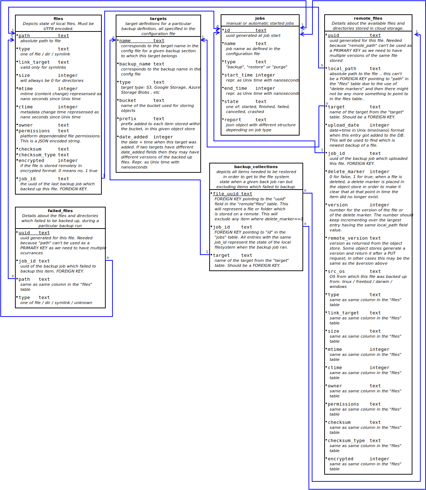

# Overview 

There is only one binary which can be started as a server or which can be used as a CLI client. In server mode this is the actual backup engine while the CLI's purpose is only to interact with the backup engine and give it instructions.

When running in server mode it requires a configuration file and also a set of static web assets which it uses for serving documentation or for service the static parts of a web UI.

Backup/Restore jobs:
- for a given backup name only one backup job can run at a time. This MUST not be changed as things in the code are done assuming this is true. For example the SQL db should not be opened in write mode by more than 1 "thing" (SQLITE limitation)
- the above stands true for restore jobs too .. no more than one at a time for a given backup name
- The 1 write "thing" DB limitation implies that a restore job CAN'T run at the same time a backup job runs for a given backup name (each backup name has a dedicated db file; a restore writes in the same db file). The reverse stands true too, a backup should never run if a restore for the same DB name is running

## Command Structure

The command and its main options are depicted below. Command line parameters are supported and can be discovered using the `--help` option. For example:
```
$ cloudbackup client backup dryrun --help
Usage:
  cloudbackup [OPTIONS] client backup dryrun [dryrun-OPTIONS] job_name

Help Options:
  -h, --help            Show this help message

[dryrun command options]
      -c, --configfile= Client configuration file expected to be in YAML format and have .yml or .yaml extension. If unspecified then the default is to attempt to use $HOME/.cloudbackup.yaml on Linux or Unixes and %HomeDrive%%HomePath% on Microsoft Windows
      -u, --username=   Username to use when connecting to the server. If not specified then an attempt will be made to use environment variable CLOUDBACKUP_CLIENT_USERNAME followed by an attempt to use the command line specified configuration file (if not specified then
                        a configuration file will be searched at the default location)
      -p, --password=   Password to use when connecting to the server. If not specified then an attempt will be made to use environment variable CLOUDBACKUP_CLIENT_PASSWORD followed by an attempt to use the command line specified configuration file (if not specified then
                        a configuration file will be searched at the default location)
      -a, --address=    Address to use when connecting to the server. The format expect is one of 'https://1.2.3.4:8443' or 'http://127.0.0.1:8080'. If not specified then an attempt will be made to use environment variable CLOUDBACKUP_CLIENT_ADDRESS followed by an
                        attempt to use the command line specified configuration file (if not specified then a configuration file will be searched at the default location)
      -d, --debug       Set logging to debug. WARNING! Secrets and passwords will be shown when using log level debug
          --jsonlog     Set logging to JSON. Defaults to plaintext
          --json        If the operation is successful then print JSON responses as they are received from server. If this option is not specified then the response is processed and the output is a plaintext table followed by a summary at the end.

[dryrun command arguments]
  job_name:             Name of the backup job to dry run. This needs to match a backup job as defined in the configuration of the server
```


## Server Components

When running in daemon mode, there are several important GO routines (called components from here one).

- daemon:
    - started by the CLI when starting up the server part of the software
    - in charge of starting the `httpd server` and `scheduler` components. It uses separate channels to communicate with each of those. 
    - once the above are started it keeps running and listening for any signals being sent (for example SIGTERM) and reacts to them. On *nix platforms it also listens for SIGUSR1 and dumps some stats to stdout when it is received. It also listens for "events"
    - if it receives a "configuration change" event from the `httpd server` then notifies the `scheduler` that it needs to reload it's configuration
    - if a "exit/shutdown" type signal is received then it sends messages to the `httpd server` and `scheduler` notifying them to exit and once they do it terminates the run of the server program.
- httpd server:
    - provides the REST API and that is the only way of controlling the software.
    - serves static files containing the documentation  
    - when a configuration change (config file change) is requested and performed then it informs the `daemon` which in turn will notify other components
    - uses a struct to keep the configuration data and both the `daemon` and `scheduler` routines have pointers to this struct (and need to use locking) 
- scheduler (starts / stops backup and restore jobs):
    - receives manual commands (backup start / stop ; restore start / stop) via the `http server`
    - receives "scheduled" job commands from the `cron` component
    - starts the `cron` component and when it receives a "shutdown/exit" or "configuration reload" it notifies the `cron` component
    - starts and stops the `watcher` component 
- cron:
    - requests backup jobs to be started based on the schedule mentioned in the configuration file
- watcher:
    - receives file/dir/symlink upload progress (and error messages) and multiplexes them to connected clients
    - clients connect to the http server using the http API and then receive HTTP2 Server-Sent Events for the specific backup or restore job they have requested
    - if either the multiplexer can't keep up with the amount of messages generated or if the client can't keep up then messages will be discarded as part of normal operation

# Database

There will be one database for each `backup` section of the config file. The structure of such a database is:



## Tables

### files

For each local file and directory belonging under a backed up path there will be an entry in the `files` table.

Entries are inserted / updated / deleted during a backup job run. The only exception to this is a manual "purge" job before a backup section of the config file is deleted/updated or worst case scenario after this has happened (this is not desirable).  

### targets

Records 1 to 1 mapping of the targets mentioned in the configuration file for a given backup job definition.

Entries in this table are added only when a backup job starts (basically it is checked that for each config target entry we have an entry in the table).

Before removing a target during configuration file update a manual "purge" job should be run (or worst case scenario afterwards). Ideall we block config file changes via the API if the purge was not ran.

### jobs

Each backup job is recorded in this table, including its final report. The unique job id is referenced from other tables
(using FOREIGN KEYs) in order to ensure a job can not be deleted as long as backed up files belong to said backup job.

### remote_files

The `remote_files` table contains a listing of all remote stored copies of the files (basically the backups). A file from the `files` table can have multiple entries in the `remote_files` table due to multiple versions of said file being backed up.
There is one case where entries in the `remote_files` tables won't have any more a corresponding entry in the `files` table and that is when the local file got deleted but we still have backed up copies of said file and a restore might request the file to be restored. 
The `version` field represents the newest backup state for a given item. The `remote_version` is the version as seen by the object store implementation. The latter is a string (for example when a PUT operation gets as a response the version from the backed object store). Some implementations may accept a version to be passed in when an upload is requested and if so then it will most likely match the `version` field. An interesting case is a meta-data update operation where program logic will only update the database entry but not the remote object store too. In this case a new `version` will have the same `remove_version` field value as the previous `version` and this is because nothing actually got changed on the object store.

### failed_files

During a particular backup run, if an item fails to be backed up, then a entry will be added to this table, mentioning the job_id of the backup job.

### backup_collections

When a file is successfully backed up then an entry is added to `remote_files` table and a reference to that entry added to this table.
If a file does not need to be backed up as it hasn't changed since the last backup then an entry is added to `backup_collections` which points to the newest entry of said item in the `remote_files` table. 
By selecting all of the items with the same `jobid` and `target` the list of a files needed to restore a particular backup is obtained. 